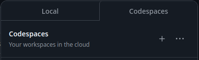

# REV Swerve
[Template Link](https://github.com/REVrobotics/MAXSwerve-Java-Template/tree/main/src/main/java/frc/robot)

## Setting Up the Codespace
**Make sure you are signed in or else you won't see the codespaces tab!!!**
- Go to the green "Code" Button.

- Click on it, select codespaces, then the + button.

